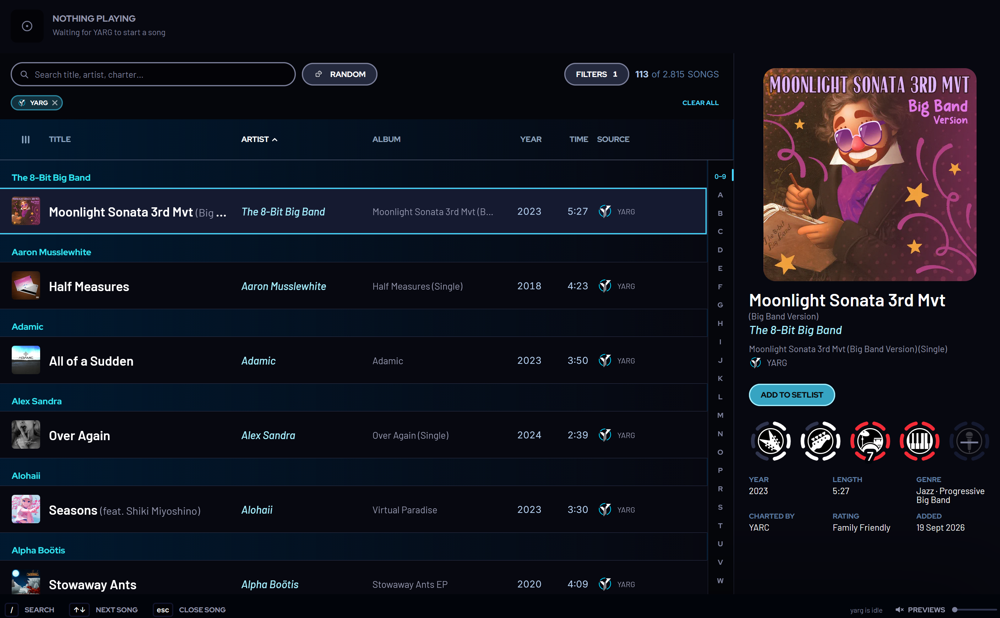
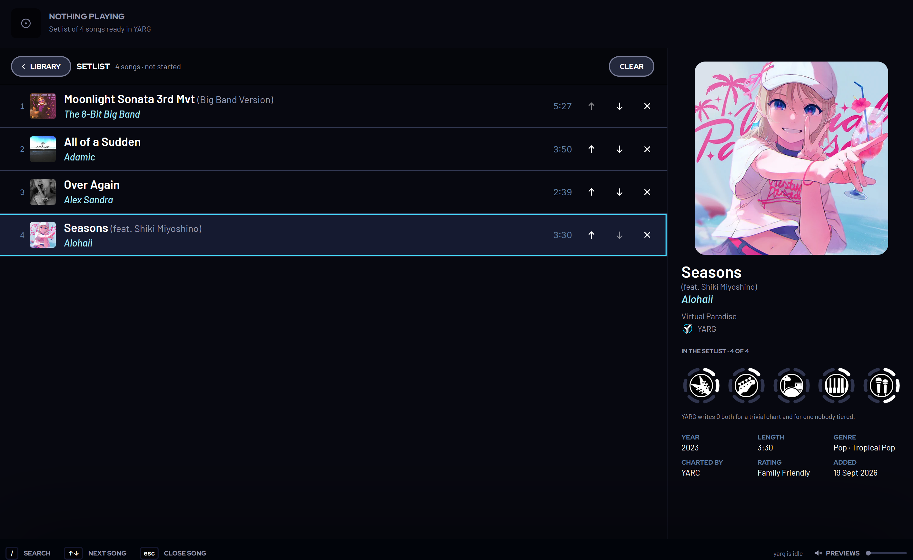
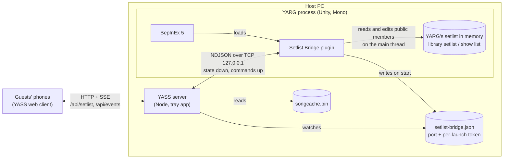
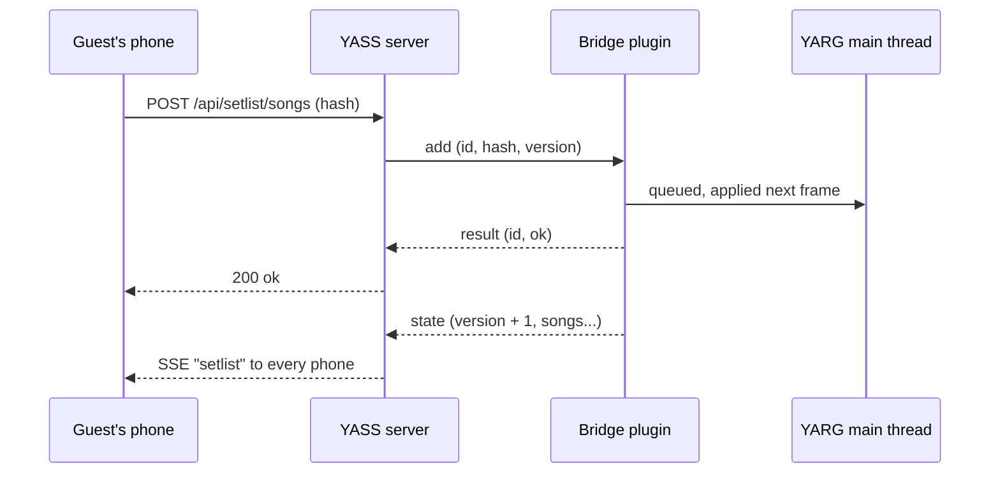

# YASS: Yet Another Song Selector

> **This is a community fork of [DevPrice/YASS](https://github.com/DevPrice/YASS).**
> YASS was created by [DevPrice](https://github.com/DevPrice), and nearly everything
> here is their work. The fork adds two features:
>
> - **Editing YARG's setlist from a phone.** This needs the
>   [YARG Setlist Bridge](https://github.com/d4g/YARG-Setlist-Bridge) plugin installed
>   in YARG; see [Optional: show and edit YARG's setlist](#optional-show-and-edit-yargs-setlist). Upstream
>   prefers to wait for native setlist support in YARG instead of a plugin (see
>   [DevPrice/YASS#4](https://github.com/DevPrice/YASS/issues/4)), so this stays in the fork.
> - **Sharing beyond your Wi-Fi** through a Cloudflare tunnel, with a key in the QR code.
>   This is also offered upstream as
>   [DevPrice/YASS#7](https://github.com/DevPrice/YASS/pull/7).
>
> Please report problems with this fork [here](https://github.com/d4g/YASS/issues), not
> upstream. The fork follows upstream and merges its changes.

YASS is a song browser for [YARG](https://yarg.in). It runs on the computer that hosts the
game and serves your song library to phones on the same network. Guests can sort, filter,
and search the library, see album art, play previews, and see which song is playing now.

YASS reads YARG's files and never writes to them. When you scan songs in YARG, every
connected phone updates automatically.

To see YASS without installing it, [try the demo](https://d4g.github.io/YASS/).

## Get started

Before you begin, scan your songs in YARG at least once.

1. From the [releases page](https://github.com/d4g/YASS/releases), download the file
   for your operating system: the `.exe` for Windows or the `.AppImage` for Linux.
1. Run the file on the computer that runs YARG. YASS has no installer and no window; its
   icon appears in the notification area.
1. Open the YASS popover. On Windows, click the icon. On Linux, right-click the icon, and
   then click **Settings…**.
1. On a phone that's on the same Wi-Fi network, scan the QR code in the popover, or enter
   the address shown there in a browser.

This fork replaces upstream YASS: it uses the same settings, so switching keeps your
configuration. Don't run both at the same time.

The Windows build isn't code-signed. If SmartScreen warns you, click **More info**, and
then click **Run anyway**.

On Linux, also do the following:

- Make the AppImage executable with `chmod +x`.
- On Ubuntu 24.04 or later, install `libfuse2`, or run the AppImage with
  `--appimage-extract-and-run`.
- For album art and previews, install ffmpeg with your package manager, and then restart
  the server.

### Share beyond your Wi-Fi

For guests who aren't on your network, YASS can open a Cloudflare quick tunnel. You
don't need a Cloudflare account.

1. In the popover, click **get cloudflared**. On Linux on ARM and on macOS, install
   cloudflared yourself instead, for example with `brew install cloudflared`.
1. Select **Share through a Cloudflare tunnel**.
1. When the QR code changes to a `trycloudflare.com` address, guests can scan it from
   anywhere.

The address includes a key, and YASS turns away tunnel visitors who don't have it. The
key and the address both change every time the server restarts. To stop an address
from working, clear the checkbox and then select it again. Through the tunnel, the
now-playing banner refreshes every two seconds instead of instantly, because
Cloudflare's quick tunnels don't carry live updates.

If YASS doesn't find your songs, open the popover, expand **Settings**, and set **YARG data
folder** to the folder that contains `songcache.bin`.

### Optional: show and edit YARG's setlist

YARG keeps its setlist in memory and doesn't save it anywhere YASS can read. With the
[YARG Setlist Bridge](https://github.com/d4g/YARG-Setlist-Bridge) plugin installed in
YARG, guests can build and change the setlist from their phones:

- **Add to setlist** from any song's details. YARG shows a notification for it, except
  during gameplay.
- **The setlist view** lets anyone reorder songs, remove them, or clear the list, both
  before a show and during one.
- **The now-playing banner** shows where a show is (for example `2/8`) and which song is
  next, or that a setlist is ready to start.

Without the plugin, YASS works exactly the same, just without the setlist.

With plugin 0.3 or later, YARG also shows the guests' QR code itself: beside the main menu,
on the music library's album cover, and on the score and song-failed screens. With plugin 0.4
or later, the score screens also show who's up next under the code: the guest's animal and
name, and the next song. The code is the
same one the YASS window shows, including the tunnel address when the tunnel is on. To hide
it, for example while streaming, clear **Show the QR code in YARG** in the YASS settings.





To set it up, install [BepInEx 5](https://github.com/BepInEx/BepInEx/releases) and the
plugin into your YARG folder, as described in the
[plugin's README](https://github.com/d4g/YARG-Setlist-Bridge#install). YASS finds it by
itself, with nothing to configure. Updating YARG through its launcher can remove BepInEx,
so you might have to install it again afterwards.

#### How it works

The plugin runs inside YARG and makes the setlist available on `127.0.0.1` only. YASS
talks to it the same way it already follows YARG's files:



- **Discovery:** the plugin writes `setlist-bridge.json`, holding its port and a token
  that changes every launch, into YARG's data folder next to `songcache.bin`.
- **Reading:** about four times a second, the plugin reads the setlist from wherever YARG
  keeps it at that moment. Before a show, that's the music library's setlist; during a
  show, it's the show list and its position. Every change is pushed to YASS.
- **Editing:** commands (add, remove, move, clear) run on YARG's main thread, and YARG
  answers each one. The changed setlist then arrives like any other update:



YARG's own rules still apply. During a show, the songs already played and the one playing
can't be changed, and each song can only be in the setlist once. Edits that depend on
positions carry the version they were made against, so when two people reorder at once,
the second gets "the setlist changed, try again" instead of a song landing in the wrong
place. The wire format is in the plugin's
[PROTOCOL.md](https://github.com/d4g/YARG-Setlist-Bridge/blob/main/PROTOCOL.md).

The plugin is a stand-in until YARG supports this natively. YASS only depends on the small
protocol, not on how the plugin works, so native support can replace it later.

## Build from source

You need Node.js 20 or later, or Node.js 22 or later to run the tests.

```bash
git clone --recurse-submodules https://github.com/d4g/YASS.git
cd YASS
npm install
npm run dev
```

The `vendor/opensource` submodule is required. If you cloned without it, run
`git submodule update --init`.

The following commands are the most common:

| Command | Description |
|---|---|
| `npm run dev` | Runs the client on port 5173 and the API on port 4321. |
| `npm test` | Runs the tests. |
| `npm run build` then `npm start` | Builds and runs the server at `http://localhost:4321`. |
| `npm run dist` | Packages the tray app for your platform into `dist/`. |

## License

YASS is in the public domain under [the Unlicense](LICENSE). The original work is by
DevPrice; the fork's changes are by d4g and are released the same way. Some bundled third-party
material has its own license; see [Third-party notices](THIRD-PARTY-NOTICES.md).

YASS is unofficial and isn't affiliated with YARC, Harmonix, Activision, or Epic Games.
